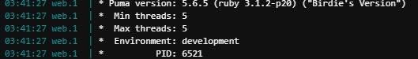
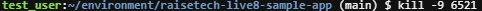
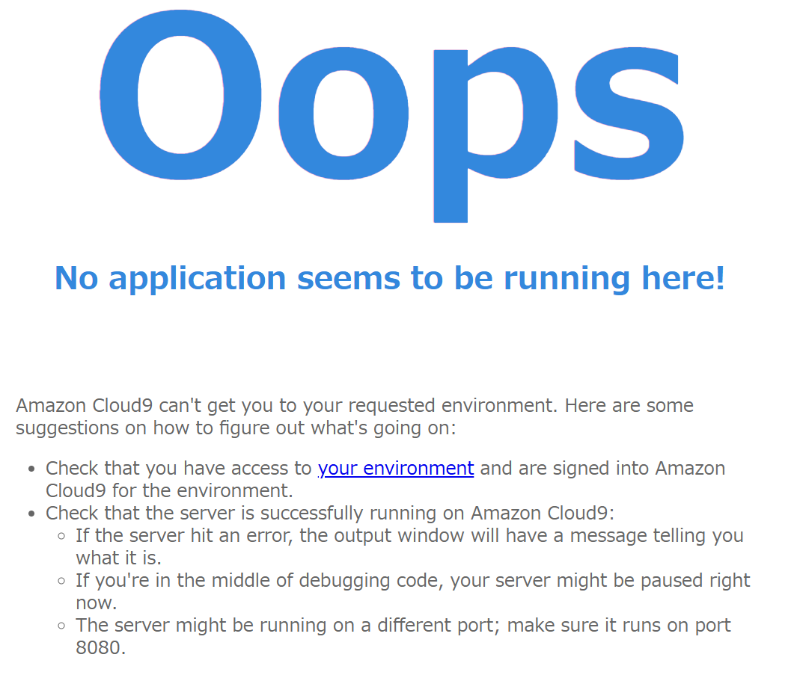
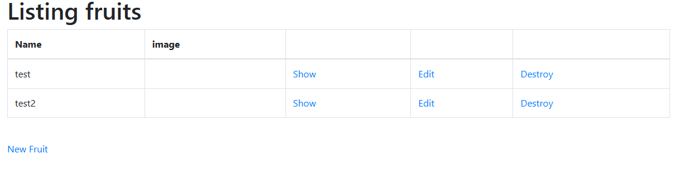
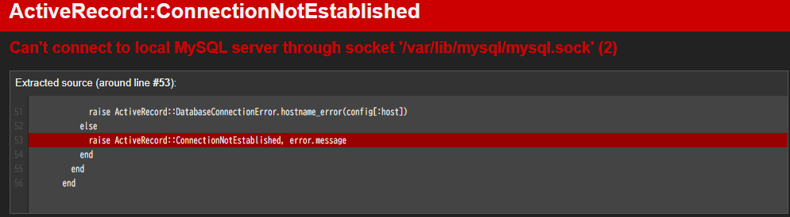

## 1.APサーバーについて
### *APサーバー名およびバージョン
PUMA(5.6.5)  

./evidenceimage/03/puma_ver.jpg

### *APサーバー終了時のアクセスの可不可
アクセス不可  
kill -9 <PUMA_ID>  
  
  
再起動  
  

## 2.DBサーバーについて
### *DBサーバー名およびバージョン
MySQL(8.0.35)  
  

### *DBサーバー終了時のアクセスの可不可
アクセス不可  
sudo service mysqld stop  
  
-起動-  
sudo service mysqld start  

### *Railsの構成管理ツール名
bundler  

# 3.学んだこと
- クライアントとサーバーはルールに基づいて通信している。
- サーバーはAPサーバーやDBサーバー等複数の構成で成り立っている。
- フレームワークを導入することで初期の開発コストを削減できる。
- RubyのフレームワークはRailsだけではなくSinatraやRamazeなど他にも存在する。
機能性、シンプル、軽量高速、楽しさ(？)などそれぞれ設計思想が違うようだ。
- アプリケーション起動時Cookieの設定を触ってみたが、
Firefoxではエラーが出るので素直にChromeを使ったほうがいいと感じた。
- 前回までMarkdownをメモ帳で編集していた。
今回VisualStudioCodeを導入したが、リアルタイムプレビューの機能がとても素晴らしいと感じた。
